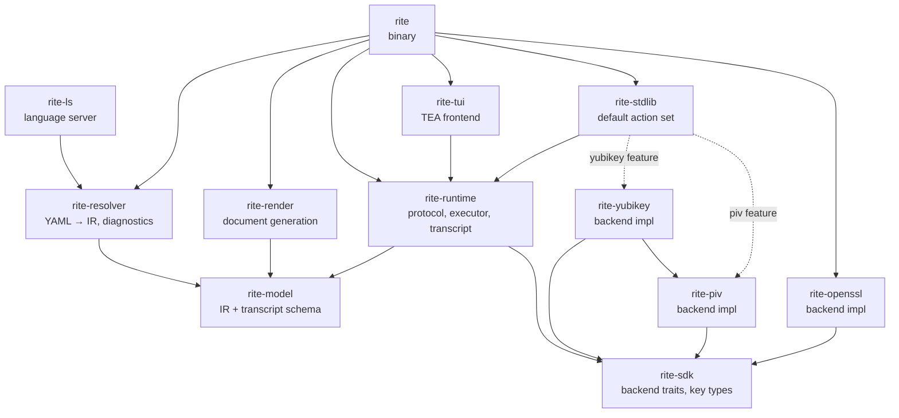

# Crate layout

| Crate           | Purpose                                                                                                                                              |
|-----------------|------------------------------------------------------------------------------------------------------------------------------------------------------|
| `rite-sdk`      | Backend traits and key-material types (`PublicKeyDer`, `CertificateDer`). The boundary any external backend implements against.                       |
| `rite-model`    | DSL IR (`Ceremony`, `Step`, `Prompt`, …) and the durable transcript schema (`StepFact`, `ResponseRecord`, …). Carries no executor or channel types.  |
| `rite-resolver` | YAML resolution and lowering, diagnostics, parameter checks.                                                                                         |
| `rite-runtime`  | Channel protocol, executor, reporter, transcript sink, action trait and registry.                                                                    |
| `rite-stdlib`   | All built-in actions: generic ones (verification, attestation, crypto, PKI) plus backend-specific ones behind features (`piv`/`yubikey`).            |
| `rite-openssl`  | OpenSSL-backed `Backend` implementation.                                                                                                             |
| `rite-piv`      | PIV smart-card `Backend` implementation (`yubikey` crate over PC/SC). Opt-in via the `piv` feature; the `piv_*` actions live in `rite-stdlib`.       |
| `rite-yubikey`  | `YubiKey` backend: PIV plus Yubico on-device attestation. Opt-in via the `yubikey` feature; the `yubikey_attest_slot` action lives in `rite-stdlib`. |
| `rite-tui`      | TEA-based interactive frontend (ratatui + crossterm).                                                                                                |
| `rite`          | `rite` binary; hosts the console and headless drivers and wires every crate above together.                                                          |
| `rite-render`   | Document generation: ceremony scripts and post-ceremony reports (HTML/PDF).                                                                          |
| `rite-ls`       | Language server for editor integration.                                                                                                              |

## Boundary rules

- A third-party verifier only needs `rite-model` to parse a transcript;
  the executor and channel types stay in `rite-runtime` for that reason.
- `rite-sdk` is the backend boundary. A backend crate (`rite-openssl`,
  `rite-piv`, `rite-yubikey`) depends only on `rite-sdk`, not the executor or
  any frontend. This keeps a first-party in-process backend a faithful mirror
  of a future out-of-process plugin, which will implement the same `rite-sdk`
  traits over JSON-RPC. The constraint is about the **backend**, not its
  actions: a backend crate carries no `Action` implementations.
- Actions live in `rite-stdlib`, never in a backend crate. Generic actions
  dispatch through the `rite-sdk` capability traits and work with any backend;
  backend-specific actions (`piv_sign`, `yubikey_attest_slot`) are feature-gated
  there too. `rite-stdlib` is the integration layer and may depend on backend
  crates (optionally, per feature) to register their actions and build them in
  the factory. Plugin backends are a goal; pluggable actions are not.
- Frontends depend on `rite-runtime` for the protocol vocabulary
  (`ExecEvent`, `UiCommand`) and on `rite-model` for the persisted types
  they render. They never reach into `rite-stdlib` or backend crates.

## Path safety

A ceremony file is untrusted input: it may be downloaded and run by an
operator who never read it. Any string that originates in a ceremony and
reaches the filesystem — an artifact id that becomes an output filename, a
material's `path:` value — must be confined so it cannot escape the directory
it belongs in (`../../…` traversal, an absolute path, or a symlink planted at
the destination).

Do not hand-roll these checks. Route every ceremony-derived path through
[`rite_model::safe_path`](../../crates/rite-model/src/safe_path.rs):

- `validate_component` / `safe_join` for a value that must be a single
  filename (artifact and output ids). The resolver validates these at load
  time; `OutputConfig::artifact_path` re-checks at the filesystem boundary so
  a new code path cannot reintroduce a traversal.
- `confine` for a value that may legitimately be a relative subpath but must
  stay within a known root (material `path:` under the ceremony directory).

These helpers are purely lexical. When *creating* a file at a confined path,
also open it with `create_new` (see `executor::write_new_file`) so a
pre-planted symlink cannot redirect the write and an existing file is never
clobbered.

For the contract between the runtime and a frontend, see
[`runtime-and-frontend.md`](./runtime-and-frontend.md).
