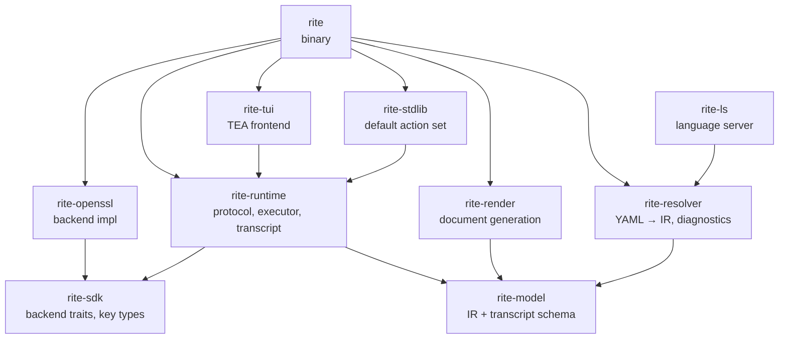

# Crate layout

| Crate           | Purpose                                                                                                                                             |
|-----------------|-----------------------------------------------------------------------------------------------------------------------------------------------------|
| `rite-sdk`      | Backend traits and key-material types. The boundary any external backend implements against.                                                        |
| `rite-model`    | DSL IR (`Ceremony`, `Step`, `Prompt`, …) and the durable transcript schema (`StepFact`, `ResponseRecord`, …). Carries no executor or channel types. |
| `rite-resolver` | YAML resolution and lowering, diagnostics, parameter checks.                                                                                        |
| `rite-runtime`  | Channel protocol, executor, reporter, transcript sink, action trait and registry.                                                                   |
| `rite-stdlib`   | Default action set (verification, attestation, crypto, PKI).                                                                                        |
| `rite-openssl`  | OpenSSL-backed `Backend` implementation.                                                                                                            |
| `rite-tui`      | TEA-based interactive frontend (ratatui + crossterm).                                                                                               |
| `rite`          | `rite` binary; hosts the console and headless drivers and wires every crate above together.                                                         |
| `rite-render`   | Document generation: ceremony scripts and post-ceremony reports (HTML/PDF).                                                                          |
| `rite-ls`       | Language server for editor integration.                                                                                                             |

## Boundary rules

- A third-party verifier only needs `rite-model` to parse a transcript;
  the executor and channel types stay in `rite-runtime` for that reason.
- `rite-sdk` is the only crate a new backend has to depend on. Adding a
  backend must not pull in the executor or any frontend crate.
- Frontends depend on `rite-runtime` for the protocol vocabulary
  (`ExecEvent`, `UiCommand`) and on `rite-model` for the persisted types
  they render. They never reach into `rite-stdlib` or backend crates.

For the contract between the runtime and a frontend, see
[`runtime-and-frontend.md`](./runtime-and-frontend.md).
