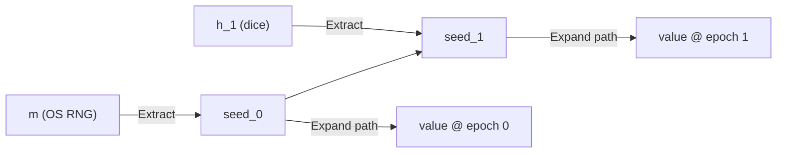

# Ceremony entropy and verifiable randomness

Every random value a ceremony consumes (a certificate serial, a nonce, a
challenge) is drawn from one auditable source and recorded in the transcript,
so `rite verify` can re-derive it and confirm it was not cherry-picked. This
document specifies the `rite-kdf/v1` derivation so an independent verifier, in
any language, can reproduce every value from the transcript alone.

## Two kinds of randomness

- **Key-material entropy** is *not* ours to generate. Backends own the bytes
  that become a private key; the tool records that a key was generated and its
  fingerprint, never the entropy behind it.
- **Protocol values** (serials, nonces, challenges) must be fresh and
  unpredictable but are *not secret*. These are what the source derives,
  records, and lets `rite verify` re-check.

## The source

A ceremony holds one `CeremonyRandom` source, seeded once at the start from the
host OS RNG (`m`). Participants may then fold their own entropy into it with the
`gather_entropy` action (for example, by rolling physical dice). Each fold
advances an *epoch*. Any value is drawn from whichever epoch seed is current
when the draw happens.



Folding uses the prior seed as the HMAC key and the contribution as the
message, so a weak or empty contribution can never reduce strength below the
machine seed; an unpredictable one only adds. This is why any operator input is
safe to accept.

## `rite-kdf/v1`

All steps use HKDF-SHA-256 (RFC 5869). The scheme is identified by the
`derivation` tag on the `entropy_seeded` fact. A verifier treats the tag as a
selector among schemes it already trusts and **rejects any tag it does not
recognise** (it is never an instruction to trust an arbitrary algorithm).

```text
seed_0       = HKDF-Extract(salt = "rite/seed/v1", IKM = m)
seed_{k+1}   = HKDF-Extract(salt = seed_k,         IKM = utf8(h_k))
path         = "<epoch>/<step>/<purpose>"
value(path)  = HKDF-Expand(seed_epoch, info = "rite/nonce/v1/" || path, len)
```

Byte encodings, fixed so verifiers agree:

- `m` and each drawn value are recorded as **lowercase hex**.
- Each contribution `h_k` is recorded as its **verbatim UTF-8 string** and fed
  to HKDF-Extract as those UTF-8 bytes.
- The salt constants and the `info` prefix are their **ASCII bytes**, with no
  trailing NUL.
- The `path` is its **ASCII string**; the `info` is the prefix concatenated
  with the path, with no separator beyond the prefix's trailing `/`.
- `<epoch>` is base-10 with no leading zeros; `<step>` is the ceremony step id;
  `<purpose>` is the drawing action's label for the value (for example,
  `cert-serial`).

A purpose is drawn at most once per step, so `(epoch, step, purpose)` uniquely
identifies a value and no counter is needed. Drawing the same `(step, purpose)`
twice is rejected (it would reuse the value). An action that needs several
values of one kind indexes the purpose itself (for example, `share-1`,
`share-2`).

## Transcript facts

Three `StepFact` variants record the source; all carry lowercase-hex bytes
where bytes appear:

- `entropy_seeded` — emitted once by the runner at ceremony start. Fields:
  `m`, `source` (provenance label, e.g. `os`), `derivation`.
- `entropy_contributed` — emitted by a `gather_entropy` step. Fields: `step`,
  `epoch` (the index produced by this fold), `contribution` (verbatim).
- `entropy_drawn` — emitted on every draw. Fields: `step`, `path`, `value`
  (the recorded value's byte length is the draw length).

## Verification

`rite verify` first checks the SHA-256 hash chain, then re-derives the source:

1. Read `entropy_seeded`; reject an unknown `derivation` and a second seed
   fact; rebuild `seed_0` from the recorded `m`.
2. Walk the facts in chain order, folding each `entropy_contributed` into the
   running seed and checking its recorded `epoch` against the fold count.
3. For each `entropy_drawn`, rebuild the `<epoch>/<step>/` path prefix from
   the verifier's own fold count and the step named on the fact and require
   the recorded path to match; reject a path drawn twice and a value longer
   than `HKDF-Expand` can produce (`255 * 32` bytes); then recompute
   `HKDF-Expand(seed_epoch, info, len)` from the recorded path, taking `len`
   from the recorded value's byte length, and confirm it equals the recorded
   value.

A tampered seed, contribution, path, or value fails the check, as does a fact
stream the runtime could never have produced (a re-seed, an epoch skip, a
reused path). Because the transcript is hash-chained, a naive byte edit is
caught by the chain first; the re-derivation additionally defeats a fully
re-chained forgery whose values are not genuinely seed-derived.

## Dry runs

A dry run seeds the source from a fixed, clearly labelled sentinel (`source:
dry-run`) so a re-derived dry-run value can never be mistaken for one
produced under real entropy.

## Worked example

`examples/showcase/dice.rite.yaml` folds a dice roll into the seed and then
issues a certificate, so the certificate serial is drawn from a seed the
operator helped shape. Running it and then `rite verify` re-derives the seed,
folds the dice contribution, and confirms the serial.
