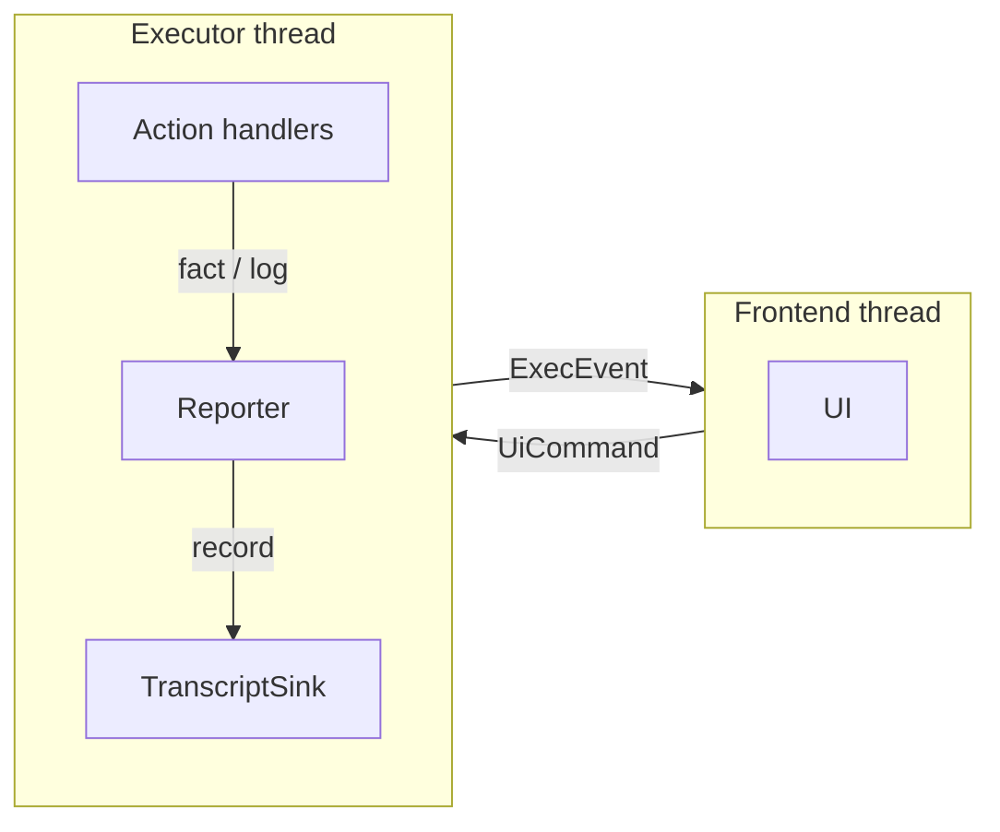
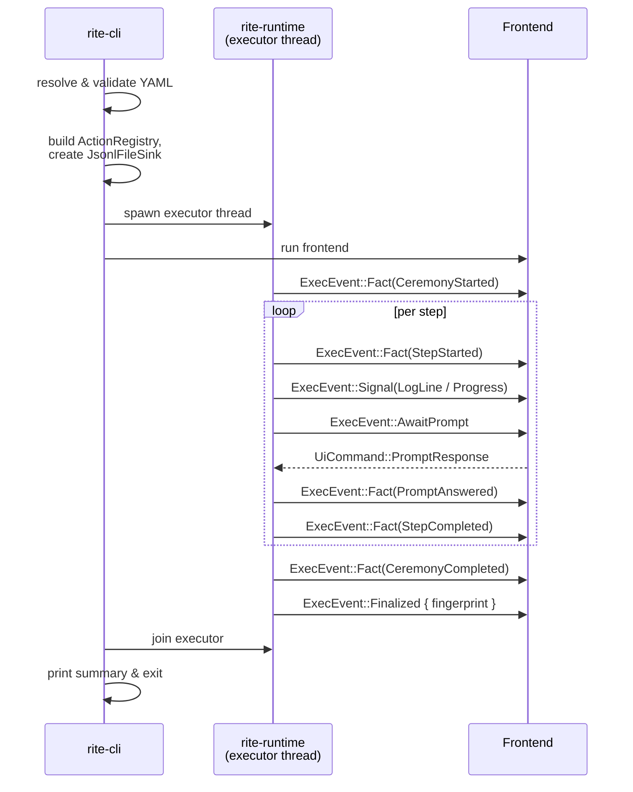

# Runtime and frontend architecture

Rite runs each ceremony as a conversation between two threads:

- **Executor thread**, walks the resolved plan, calls action handlers,
  records every transcript-worthy fact synchronously to disk.
- **Frontend thread**, renders the ceremony to a human (TUI, console,
  or headless driver) and sends commands back.

They speak through two crossbeam channels and share nothing else.



## The protocol

The protocol is the audit surface. Everything the runtime sends to a
frontend is an [`ExecEvent`]; everything a frontend sends back is a
[`UiCommand`].

### `ExecEvent`

| Variant                     | Direction          | Carried in transcript?                       | Purpose                                                               |
|-----------------------------|--------------------|----------------------------------------------|-----------------------------------------------------------------------|
| `Fact(StepFact)`            | runtime → frontend | yes, written *before* the event is forwarded | Durable record of something that happened.                            |
| `Signal(UiSignal)`          | runtime → frontend | no                                           | Transient UI hint (log line, progress).                               |
| `AwaitPrompt { … }`         | runtime → frontend | no (the answer becomes a fact)               | Block until the operator answers.                                     |
| `Finalized { fingerprint }` | runtime → frontend | no (out-of-band)                             | Sent after the terminal fact so frontends can display the chain head. |

### `StepFact`

Every variant of `StepFact` is what would convince a future auditor that
the step happened the way the transcript claims. The kinds:

- `CeremonyStarted` / `CeremonyCompleted` / `CeremonyFailed`
- `ActStarted` / `StepStarted` / `StepCompleted`
- `PromptAnswered` (the prompt itself plus a redacted response)
- `BackendOperation` (`kind` + structured `inputs` / `outputs` JSON)
- `AttestationRecorded`
- `ArtifactWritten`
- `DeviationRecorded`

Action handlers emit `BackendOperation` and `AttestationRecorded`
directly. The executor emits the rest automatically at the corresponding
lifecycle boundary.

### `UiCommand`

| Variant                                  | Purpose                                               |
|------------------------------------------|-------------------------------------------------------|
| `PromptResponse { prompt_id, response }` | Answer a pending `AwaitPrompt`.                       |
| `LogDeviation { text }`                  | Record an operator deviation at any time.             |
| `Abort`                                  | Request the runtime to unwind at the next safe point. |

## Reporter

Action handlers do not touch the channels or the transcript directly.
They receive a `&mut Reporter<'_>` and call:

```rust
reporter.fact(StepFact::BackendOperation { … })?;     // durable
reporter.log(Icon::Spinner, "signing…")?;             // UI-only
reporter.progress("verifying", Some(0.42))?;          // UI-only
let response = reporter.prompt(&Prompt::Confirm { … })?;
reporter.check_abort()?;
```

Cooperative cancellation works through `check_abort`, which non-blockingly
drains the command channel and returns `ActionError::Aborted` if an
abort is queued. While a prompt is in flight, the reporter also folds in
any deviation and abort commands so neither blocks waiting for the next
step boundary.

## Transcript sink

The runtime owns one transcript sink for the duration of a run. The
trait is small:

```rust
pub trait TranscriptSink: Send {
    fn record(&mut self, fact: &StepFact) -> io::Result<()>;
    fn finalize(&mut self) -> io::Result<TranscriptFingerprint>;
}
```

The default implementation, `JsonlFileSink`, writes one line per fact
and `fsync`s before returning, so a fact the executor has moved past
cannot be lost to a subsequent crash or power loss. Each line:

```jsonc
{"prev_hash": "sha256:…", "fact": { "type": "step_started", … }}
```

Each line's SHA-256 is the next line's `prev_hash`. The hash of the
final line *is* the transcript fingerprint; the JSONL is self-identifying
and no sidecar file is written. `rite verify` walks the chain and
returns that fingerprint.

## Frontend architecture (TEA)

`rite-tui` is shaped as the Elm Architecture extended with a `Cmd` list.
Three rules:

1. **`Model`** is the only mutable state.
2. **`update(model, msg) → Vec<Cmd>`** is the only function allowed to
   mutate the model. It is pure: no I/O, no threads, no channels.
3. **`view(model, frame)`** is the only place rendering happens. Also
   pure: it never mutates state.

`Msg` is the entire UI-transition audit surface:

```rust
pub enum Msg {
    Key(KeyEvent),
    Resize { cols: u16, rows: u16 },
    Mouse(MouseEvent),
    Tick,
    Exec(ExecEvent),
    Quit,
}
```

`Cmd` is the entire side-effect surface:

```rust
pub enum Cmd {
    SendCommand(UiCommand),
    Quit,
}
```

The main loop merges three message sources into the `msg_rx` channel:

- a thread polling `crossterm` for input (keys, resize, mouse)
- a tick thread for spinner animation
- a forwarder that translates `ExecEvent` from the runtime channel into
  `Msg::Exec(...)`

Each iteration calls `update` once, interprets the returned `Cmd`s
(sending to the runtime, quitting), and redraws.

### `Screen`

```rust
pub enum Screen {
    Step { tab: StepTab },
    DeviationModal { input: String },
    AbortConfirm,
    Completed { fingerprint: Option<String> },
    Failed { reason: String },
}
```

There is exactly one `Screen` active at any moment, the borrow checker
enforces that we can never sit "in a modal over a different modal."

## Drivers

Three frontends consume the same protocol:

- **`rite-tui`**, interactive TEA application built on `ratatui`.
- **`rite-cli::console`**, straight-line stdin/stdout driver. Reference
  implementation of the protocol; the smallest viable frontend.
- **`rite-cli::headless`**, auto-answers prompts per a defaults policy
  (yes for confirms, the expected string for literals, ack for
  continues, fail-fast for free-form text and secrets). Used for CI
  smoke tests.

`rite run --frontend=tui|console|headless` selects between them; the
default is `tui` when stdout is a TTY and the `tui` feature is built in.

## Lifecycle of a run



A panic on the frontend thread closes the channel; the executor sees
the disconnect and unwinds with a `CeremonyFailed` fact recorded to
disk. A panic on the executor thread fails the join handle; the frontend
exits cleanly and the CLI prints a diagnostic.

[`ExecEvent`]: ../../crates/rite-runtime/src/protocol.rs
[`UiCommand`]: ../../crates/rite-runtime/src/protocol.rs
